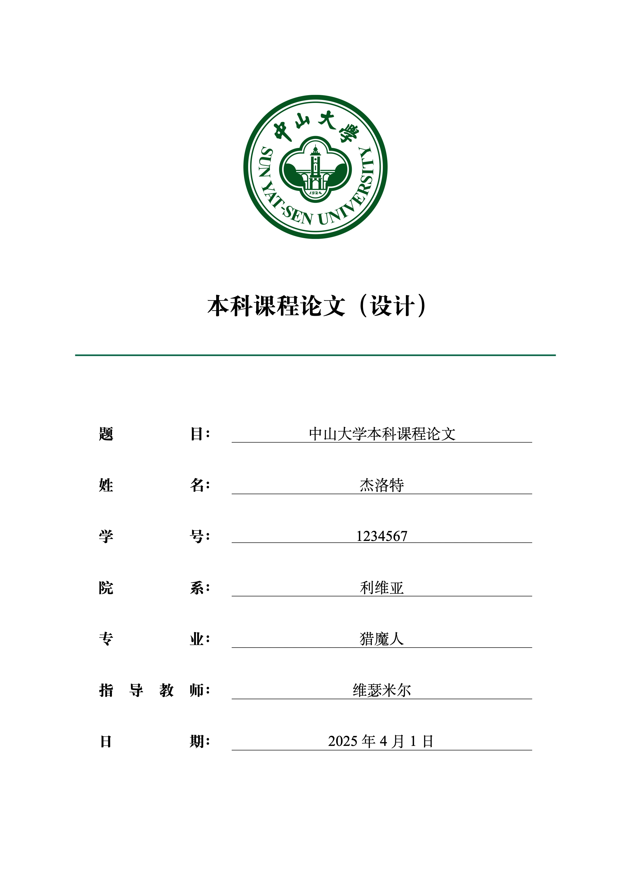
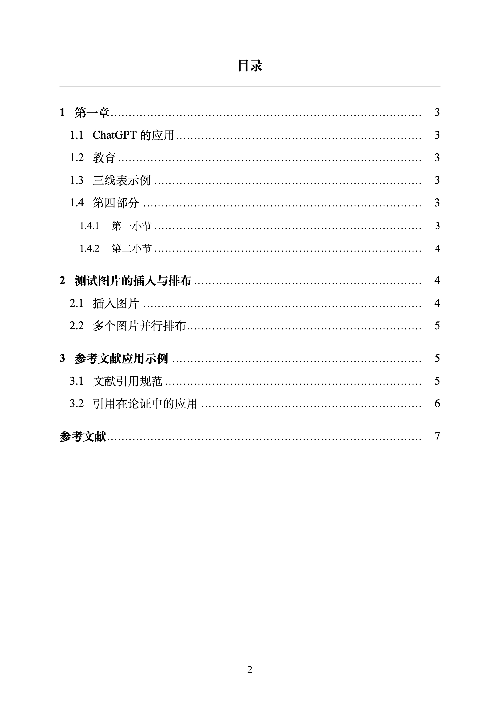
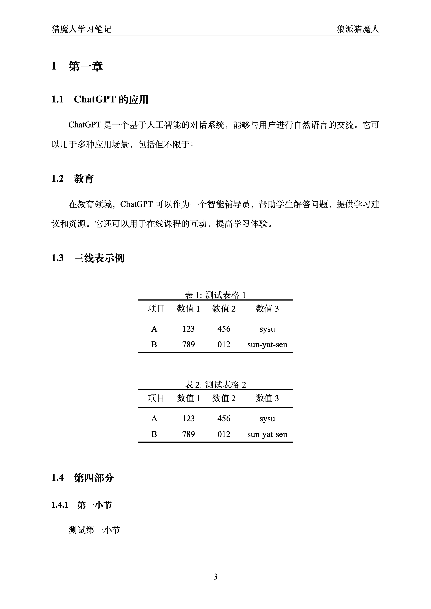
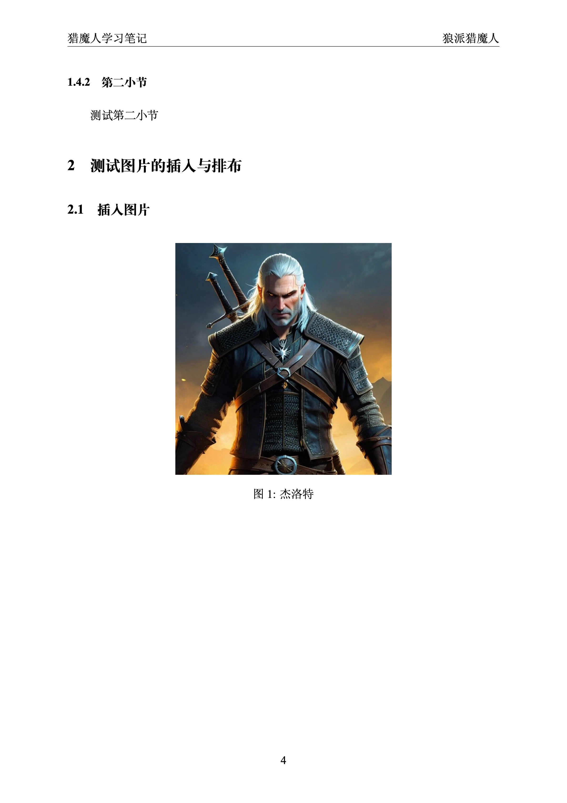
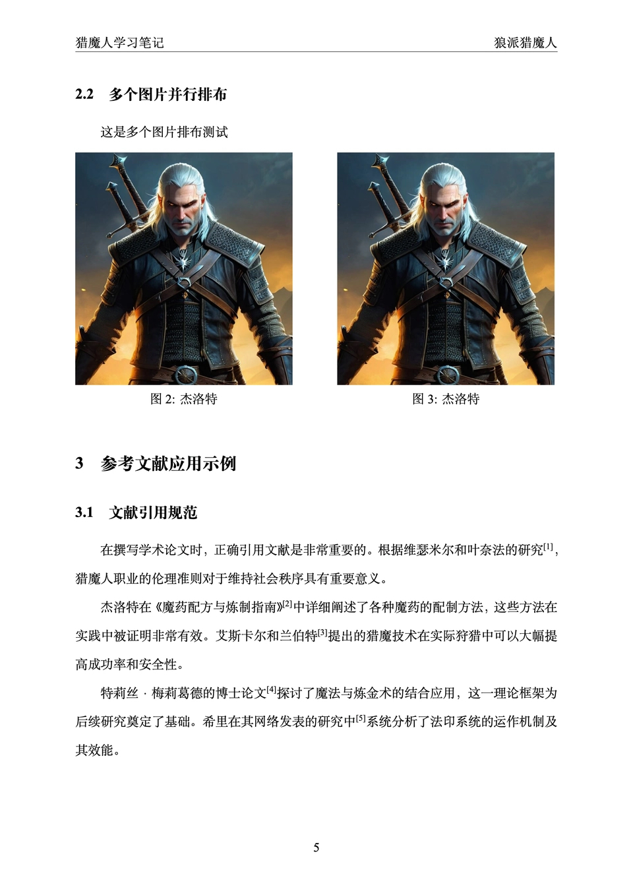
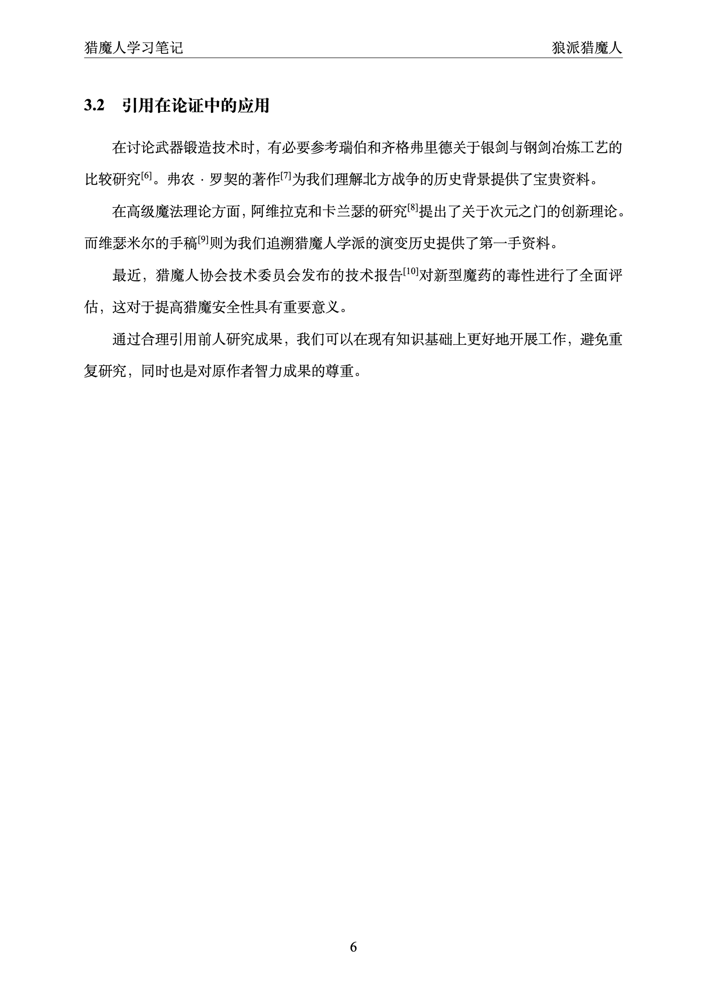
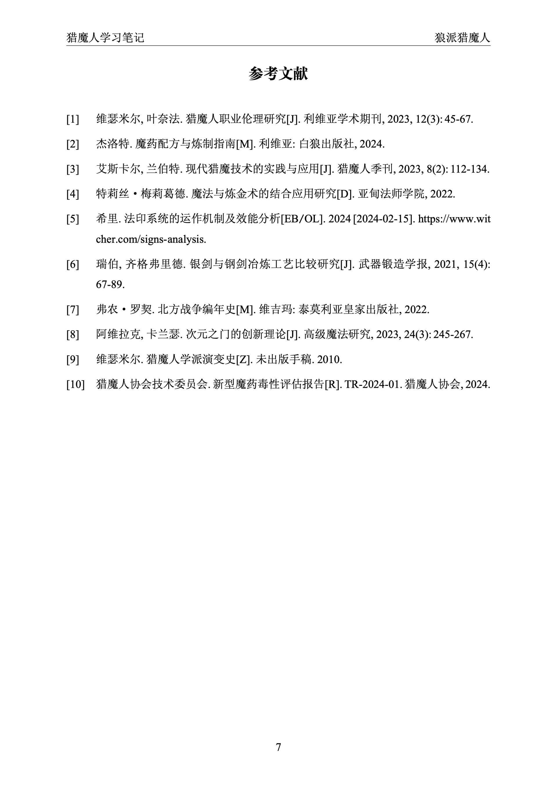

# SYSU课程论文模版


## 简介

本模版只是为了方便拿来写一些课程论文，对作者而言，摆脱了`Word`艰难的排版方式、老是对不齐和乱跑的图片、频繁调节字体的型号等等。当然并不是说`Word`就一定比`LaTeX`差，哪个用的顺手就用哪个。

## 预览
1. 封面

2. 摘要

3. 目录

4. 章节
- 章节一 

- 章节二

- 章节三

5. 参考文献
- 标注参考文献

- 打印参考文献

---

## 运行
1. 建议在`overleaf`上运行，选择`xelatex`编译器
2. vscode+overleaf插件（笔者采用此模式）
---
## 项目结构

```
project/
├── main.tex                % 主文档
├── settings/
│   ├── packages.tex        % 宏包加载
│   ├── fonts.tex           % 字体设置
│   ├── layout.tex          % 页面布局和样式设置
│   ├── commands.tex        % 自定义命令
├── docs/
│   ├── titlepage.tex       % 封面页
│   ├── abstract.tex        % 摘要
│   ├── chat1.tex           % 第一章内容
│   ├── chat2.tex           % 第二章内容
│   ├── chat3.tex           % 第三章内容
│   ├── reference.tex       % 参考文献
│   ├── reference.bib       % 参考文献数据库
└── photo/                  % 图片文件夹
    └── sysu-logo.pdf       % 校徽图片
```
---
## 文件细节
1. `main.tex`: 主文件，整合所有模块。
2. `settings/packages.tex`: 加载所有需要的宏包，包括字体设置、页面布局、参考文献格式等。
3. `settings/fonts.tex`: 设置字体和字号，定义了二号、三号、小三、四号、小四、五号等中文字号。
4. `settings/layout.tex`: 设置页面大小、页边距、行距、页眉页脚和目录格式等。
5. `settings/commands.tex`: 定义了一些自定义命令，如居中章节标题、目录后添加横线等。
6. `docs/titlepage.tex`: 定义封面页样式，包括学校标志、论文标题、作者信息等。
7. `docs/abstract.tex`: 论文摘要和关键词部分。
8. `docs/chat1.tex`等: 论文正文各章节内容。
9. `docs/reference.tex`: 参考文献设置和打印。
10. `docs/reference.bib`: BibTeX格式的参考文献数据库。
---
### 补充说明
#### 字体与字号
本模板预定义了常用的中文字号，便于直接调用：

| 命令 | 字号 | 磅值 |
|------|------|------|
| `\erhao` | 二号 | 22pt |
| `\sanhao` | 三号 | 16pt |
| `\xiaosan` | 小三 | 15pt |
| `\sihao` | 四号 | 14pt |
| `\xiaosi` | 小四 | 12pt |
| `\wuhao` | 五号 | 10.5pt |

默认正文采用宋体小四号字体，可以根据需要调整。

#### 参考文献
本模板采用 `biblatex` 宏包管理参考文献，具有以下特点：

1. **国标格式**：采用 GB/T 7714-2015 引用格式，符合中文学术论文规范
2. **参考文献编号**：序号左对齐
3. **排序方式**：按照引用顺序编号，而非按作者或年份排序
4. **自动加入目录**：参考文献会自动添加到目录中，无需额外操作
 
5. **参考文献格式**
- 修改settings/packages.tex中biblatex的选项可调整参考文献格式
- 常用选项包括sorting=none（按引用顺序）、gbalign=left（左对齐）等